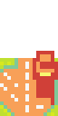
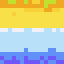
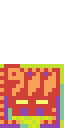
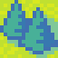
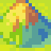
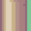
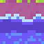

# Compte-rendu PO

---

**Binôme 16**

- LECONTE--DENIS Tristan
- GRAVOT Lucien

## Sommaire

---

1. [Introduction](#introduction)
2. [Github](#github)
3. [UML](#uml)
4. [Rapport](#rapport)

## I. Introduction

---

Dans ce compte-rendu, nous allons expliquer la direction qu'a pris le projet au cours de son développement.
Nous allons présenter les différentes étapes du développement, les choix d'implémentations qui ont été réalisées, les
difficultés rencontrées et les solutions apportées.
De plus, nous allons expliquer les bonus du projet qui ont été réalisés.

## II. Github

--- 

Afin de pouvoir travailler en binôme sur le projet de façon efficace et organiser, nous avons décidé d'utiliser l'outil
de versioning git, à travers un dépôt github.
Il est donc possible de voir l'évolution du projet à travers les différents commits réalisés. Le depot est accessible à
l'adresse suivante :
[Lien du Github](https://github.com/LeMeuble/PO-projet_AW)

## III. UML

--- 

Pour permettre une visualisation globale de l'ensemble du projet, nous avons réalisé un diagramme UML avec les
différentes classes et leurs relations.

## IV. Rapport

---

### 1. Base du jeu

---

#### a. Carte

---

La carte est représentée par une liste de *Case* à deux dimensions. Chaque case contient nécessairement un *Terrain* et une potentielle
*Unit*. La création de la carte se fait à partir de deux fichiers textes (voir [Bonus : Parseur de carte](#bonus-parser)), un fichier de carte `carte.adwcmap` et un fichier
de métadonnées `carte.meta`. L'un contient la structure de la carte au format ASCII, l'autre contient les données concernant la map (taille, nom, nombre de joueurs, etc...).
Afin d'implémentation des variations de textures [Changement : Texture](#change-texture), il a fallu créer un nouveau parseur pour la map *MapParser* qui s'occupe de transformer le fichier de la map,
en *Grid*. La classe *Grid* est une classe qui permet de représenter la carte sous forme de matrice de *Case*. Le parseur permet également de vérifier l'intégrité de la map (ex: bon nombre de QG).

#### b. Terrains

--- 

Voici la liste des terrains implémentés dans le jeu :

| Terrain  | Type              | Particularité                                       | Texture                                                             |
|----------|-------------------|-----------------------------------------------------|---------------------------------------------------------------------|
| Aéroport | Propriété, usine  | Produit des unités aériennes. Peut être capturé.    |               |
| Plage    | Terrain classique | Permet aux barges d'accoster                        |        |
| Ville    | Propriété         | Donne de l'argent à chaque tour. Peut être capturé. |                     |
| Usine    | Propriété, usine  | Produit des unités terrestres. Peut être capturé.   |               |
| Forêt    | Terrain classique |                                                     |             |
| QG       | Propriété         | Propriété la plus importante! A défendre!           |                         |
| Montagne | Terrain classique |                                                     |         |
| Obstacle | Terrain classique | Infranchissable mais survolable.                    |  |
| Plaine   | Terrain classique |                                                     |               |
| Port     | Propriété, usine  | Produit des unités navales. Peut être capturé.      |                     |
| Eau      | Terrain classique |                                                     |        |

#### c. Unités

---

Voici la liste des unités implémentées dans le jeu :

| Unité       | Texture |
|-------------|---------|
| Porte-avion |         | 
| Anti air    |         | 
| Artillerie  |         | 
| Bazooka     |         | 
| Bombardier  |         | 
| Convoi      |         | 
| Corvette    |         | 
| Croiseur    |         | 
| Dreadnought |         | 
| Hélicoptère |         | 
| Infanterie  |         | 
| Barge       |         | 
| Lancer SAM  |         | 
| Sous-marin  |         | 
| Tank        |         | 

#### Armes 

---

Pour les armes, nous avons créé une classe abstraite *Weapon*, et nous avons distingué les armes ayant une portée d'une
case (classe abstraite *MeleeWeapon*, étendant *Weapon*) et celles ayant plus d'une case de portée (classe abstraite 
*RangedWeapon*, étendant aussi *Weapon*). Enfin, nous avons fait une classe par arme devant être implémentée 
(ex : *HeavyMachineGun*)

Dans chacune de ces classes, nous avons ajouté une énumération du multiplicateur de dégâts en fonction du type 
d'unité cible.

#### Capture

---

La capture d'une propriété est implémentée dans la classe abstraite *Unit*. Une méthode `Unit#capture` permet de faire 
baisser la défense d'une propriété ennemie, et de changer son propriétaire vers le joueur courant si sa vie descend en
dessous de 0.
Nous avons cependant choisi de permettre à la capture d'être effectuée par plusieurs unités différentes, ainsi que de
faire regagner 5 points de santé par tour à la propriété, plutôt que 20 d'un seul coup.

#### Types de propriétés

---

Les propriétés sont représentées par la classe abstraite *Property*. Cependant, il peut y avoir plus de 2 QG, pour 
faire des parties avec jusqu'à 5 joueurs, voir [Bonus / Choix d'ajouts](#2-bonus--choix-dajouts).

#### Usines et crédits

---

Pour implémenter les usines, nous avons créé une classe abstraite *Factory*, qui étend *Property*. Ainsi, nous pouvons
avoir des terrains qui sont des usines (peuvent produire des unités) mais également des propriétés (peuvent être possédées par
un joueur).

Puis, nous avons créé le type de terrain *FactoryTerrain*, représentant une usine terrestre. (En anticipation des ports
et des aéroports, voir [Bonus / Choix d'ajouts](#2-bonus--choix-dajouts).

Pour les crédits, nous avons ajouté 1000 crédits à chaque joueur, par propriétés qu'il possède, à chaque fois que tous
les joueurs de la partie ont joué leur tour (passage au jour suivant).

### 2. Bonus / Choix d'ajouts

#### a. Parseur de carte

---

### 3. Changement du squelette initial

### 4. Textures du jeu

--- 

Concernant les textures, nous avons décidé de changer les textures fournies avec le squelette du projet car nous
préférions les graphismes
du jeu Advance Wars II : Black Hole Rising.
Nous avons donc réorganisé les textures dans le dossier *textures*. Les textures sont tirées du
site [Spriters Resource](https://www.spriters-resource.com/game_boy_advance/advancewars2blackholerising/). La partie
texture du projet étant secondaire,
nous avons fait appel à une aide extérieure (voir [Crédits](#credits)) qui nous a permis d'extraire l'ensemble des
textures et de les organiser.
L'ensemble des textures utilisées sont libres de droit pour tout projet à but non lucratif. Pour plus d'informations, voir directement
sur le site : [FAQ Copyright Spriters Ressource](https://www.spriters-resource.com/page/faq/)

## V. Crédits

- [Yohann COURTAND](https://github.com/maYayoh) : Extraction complète des textures
  de [Spriters Resource](https://www.spriters-resource.com/game_boy_advance/advancewars2blackholerising/) et création de quelques textures supplémentaires.