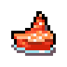

# Compte-rendu PO

---

**Binôme 16**

- PandaLunatique
- LeMeuble 

## Sommaire

---

1. [Introduction](#introduction)
2. [Github](#github)
3. [UML](#uml)
4. [Rapport](#rapport)
    1. [Base du jeu](#report-base)
    2. [Bonus | Choix d'ajouts](#report-bonus)
    2. [Liste des bonus réalises](#report-bonus-list)
5. [Texture du jeu](#change-texture)
6. [Création de fr.istic.map](#fr.istic.map-creation)
7. [Tests unitaires](#tests)
8. [Crédits](#credits)

Pour la lecture de ce rapport, il est préférable de le lire sur Github afin d'avoir les accès rapides aux classes et
méthodes.

## I. Introduction

---

Dans ce compte-rendu, nous allons expliquer la direction qu'a pris le projet au cours de son développement.
Nous allons présenter les différentes étapes du développement, les choix d'implémentations qui ont été réalisées, les
difficultés rencontrées et les solutions apportées.
De plus, nous allons expliquer les bonus du projet qui ont été réalisés ainsi que les éléments du squelette qui ont été
modifiés.

## II. Github

--- 

Afin de pouvoir travailler en binôme sur le projet de façon efficace et organiser, nous avons décidé d'utiliser l'outil
de versioning git, à travers un dépôt github.
Il est donc possible de voir l'évolution du projet à travers les différents commits réalisés. Le dépôt est accessible à
l'adresse suivante :
[Lien du Github](https://github.com/LeMeuble/PO-projet_AW)

## III. UML

--- 

Pour permettre une visualisation globale de l'ensemble du projet, nous avons réalisé un diagramme UML avec les
différentes classes et leurs relations.

Pour un diagramme plus détaillé, il est possible de le trouver à l'adresse suivante :
[Diagramme UML détaillé](https://imgur.com/JJzje1e.png)

## IV. Rapport

---

### 1. Base du jeu

---

#### Plateau de jeu

---

Le plateau de jeu est représenté par une matrice à deux dimensions encapsulée dans la
classe [`Grid`](./src/main/fr.istic.map/Grid.java). Cette dernière
permet
une utilisation simple de la liste à deux dimensions interne de [`Case`](./src/main/fr.istic.map/Case.java). Chaque case contient
nécessairement un [`Terrain`](./src/main/fr.istic.terrain/Terrain.java)
et
une potentielle [`Unit`](./src/main/fr.istic.unit/Unit.java). Une instance de [`Grid`](./src/main/fr.istic.map/Grid.java) est créée en
début de chaque partie selon la fr.istic.map sélectionnée. Le tableau
à
deux dimensions est rempli grâce au parseur qui permet la conversion d'un fichier texte (au format ASCII) en une matrice
de [`Case`](./src/main/fr.istic.map/Case.java).
L'implémentation du parseur a été changé pour les besoins du projet : [Bonus | Parseur de carte](#report-bonus-fr.istic.parser).

#### Terrains

---

Les [`Terrain`](./src/main/fr.istic.terrain/Terrain.java) sont contenus dans une [`Case`](./src/main/fr.istic.map/Case.java) de
la [`Grid`](./src/main/fr.istic.map/Grid.java). Pour cette
implémentation, nous avons décidé de créer une
classe abstraite
[`Terrain`](./src/main/fr.istic.terrain/Terrain.java) qui est étendues par toutes les sous-classes. Certains particuliers ont une
classe mère abstraite
intermédiaire : la classe [`Property`](./src/main/fr.istic.terrain/Property.java)
Voici la liste des terrains implémentés dans le jeu :

| Terrain  | Classe mère | Particularité                                        | Texture                                                             |
|----------|-------------|------------------------------------------------------|---------------------------------------------------------------------|
| Aéroport | Factory     | Produit des unités aériennes. Peut être capturé.     |               |
| Port     | Factory     | Produit des unités navales. Peut être capturé.       |                     |
| Usine    | Factory     | Produit des unités terrestres. Peut être capturé.    |               |
| Ville    | Property    | Donne de l'argent à chaque tour. Peut être capturé.  |                     |
| QG       | Property    | Propriété la plus importante! A défendre!            |                         |
| Plage    | Terrain     | Permet aux barges d'accoster.                        |        |
| Forêt    | Terrain     |                                                      |             |
| Montagne | Terrain     |                                                      |         |
| Obstacle | Terrain     | Infranchissable mais survolable.                     |  |
| Plaine   | Terrain     |                                                      |               |
| Eau      | Terrain     |                                                      |        |

#### Unités

---

Concernant les unités, nous avons dû faire une structure avec plusieurs classes abstraites. Ainsi, nous avons une classe
mère abstraite [`Unit`](./src/main/fr.istic.unit/Unit.java) qui est étendue par les
classes [`Naval`](./src/main/fr.istic.unit/Naval.java), [`OnFoot`](./src/main/fr.istic.unit/OnFoot.java), [`Flying`](./src/main/fr.istic.unit/Flying.java)
et [`Motorized`](./src/main/fr.istic.unit/Motorized.java). Ces dernières sont
elles-mêmes
étendues par des classes les classes propres à chaque type d'unité.
Voici la liste des unités implémentées dans le jeu :

| Unité       |                    | Texture                                                                    |
|-------------|--------------------|----------------------------------------------------------------------------|
| Porte-avion | NavalTransport     |  | 
| Anti air    | Motorized          |                  | 
| Artillerie  | Motorized          |                | 
| Bazooka     | OnFoot             |                    | 
| Bombardier  | Flying             |                      | 
| Convoi      | MotorizedTransport |                      | 
| Corvette    | NavalTransport     |                  | 
| Croiseur    | Naval              |                    | 
| Cuirassé    | Naval              |               | 
| Hélicoptère | FlyingTransport    |              | 
| Infanterie  | OnFoot             |                  | 
| Barge       | NavalTransport     |          | 
| Lancer SAM  | Motorized          |          | 
| Sous-marin  | Naval              |                | 
| Tank        | Motorized          |                          | 

Toutes ces unités sont déclinées en 5 couleurs, pour les 5 joueurs différents (
voir [Bonus | Choix d'ajouts](#2-bonus--choix-dajouts))

Pour les transports, il s'agit d'un cas particulier. En effet, les transports ont une classe abstraite intermédiaire par
type de d'unité.
Par exemple, les transports à chenille ont une classe
abstraite [`MotorizedTransport`](./src/main/fr.istic.unit/MotorizedTransport.java). Chacune des classes abstraites
intermédiaires de transport implémentent
l'interface [`Transport`](./src/main/fr.istic.unit/Transport.java) qui permet de définir les méthodes communes à tous les
transports.

#### Déplacement

---

Nous avons créé une classe [`Movement`](./src/main/fr.istic.game/Movement.java), qui contient 2 classes
internes : [`Weapon.Direction`](./src/main/fr.istic.game/Movement.java) (énumération des directions
possibles : up, left, begin, etc...) et [`Movement.Arrow`](./src/main/fr.istic.game/Movement.java). Cette dernière
représente une flèche dans une case, par son bord d'entrée et son bord de sortie. Le système de flèche est complètement
différent de celui demandé dans le sujet. (voir [Bonus | Choix d'ajouts](#2-bonus--choix-dajouts))

#### Armes

---

Pour les armes, nous avons créé une classe abstraite [`Weapon`](./src/main/fr.istic.weapon/Weapon.java), et nous avons distingué
les armes ayant une portée d'une
case (classe abstraite [`Weapon`](./src/main/fr.istic.weapon/MeleeWeapon.java),
étendant [`Weapon`](./src/main/fr.istic.weapon/Weapon.java)) et celles ayant plus d'une case de portée (classe abstraite
[`Weapon`](./src/main/fr.istic.weapon/RangedWeapon.java), étendant aussi [`Weapon`](./src/main/fr.istic.weapon/Weapon.java)). Enfin, nous
avons fait une classe par arme devant être implémentée
(ex : [`Weapon`](./src/main/fr.istic.weapon/type/HeavyMachineGun.java))

Dans chacune de ces classes, nous avons ajouté une énumération du multiplicateur de dégâts en fonction du type
d'unité cible.

#### Capture

---

La capture d'une propriété est implémentée dans la classe abstraite [`Unit`](./src/main/fr.istic.unit/Unit.java). La
méthode [`Unit#attack`](./src/main/fr.istic.unit/Unit.java) permet de faire
baisser la défense d'une propriété ennemie, et de changer son propriétaire vers le joueur courant si sa vie descend en
dessous de 0.
Nous avons cependant choisi de permettre à la capture d'être effectuée par plusieurs unités différentes, ainsi que de
faire regagner 5 points de santé par tour à la propriété, plutôt que 20 d'un seul coup.

#### Types de propriétés

---

Les propriétés sont représentées par la classe abstraite [`Property`](./src/main/fr.istic.terrain/Property.java). Cependant, il
peut y avoir plus de 2 QG, pour
faire des parties jusqu'à 5 joueurs, voir [Bonus | Choix d'ajouts](#2-bonus--choix-dajouts). Un joueur qui capture
un QG en devient ainsi le
propriétaire. De ce fait, un joueur est considéré comme éliminé s'il n'a plus aucun QG disponible.

#### Usines et crédits

---

Pour implémenter les usines, nous avons créé une classe abstraite [`Factory`](./src/main/fr.istic.terrain/Factory.java), qui
étend [`Property`](./src/main/fr.istic.terrain/Property.java). Ainsi, nous pouvons
avoir des terrains qui sont des usines (peuvent produire des unités) mais également des propriétés (peuvent être
possédées par
un joueur).

Puis, nous avons créé le type de fr.istic.terrain [`FactoryTerrain`](./src/main/fr.istic.terrain/type/FactoryTerrain.java), représentant
une
usine terrestre. (En anticipation des ports
et des aéroports, voir [Bonus | Choix d'ajouts](#report-bonus).)

Pour les crédits, nous avons ajouté 1000 crédits à chaque joueur pour chaque propriété qu'il possède, à chaque fois que
tous
les joueurs de la partie ont joué leur tour (passage au jour suivant).

### 2. Bonus | Choix d'ajouts

---

#### Plateau de jeu | Parseur

---

Pour le parseur de carte, nous avons décidé d'apporter quelques modifications par rapport au sujet. En effet, nous avons
modifié dans un premier temps la syntaxe ASCII pour inclure la possibilité d'ajouter des variations de textures.
La création de la carte se fait à partir de deux fichiers textes, un fichier de carte `carte.adwcmap` qui contient les
données du plateau de jeu (de la grille)
au format ASCII et un fichier de métadonnées `carte.meta` qui contient les données concernant la fr.istic.map (taille, nom,
nombre de joueurs, etc...).
Afin d'implémentation des variations de textures [Changement | Texture](#change-texture), il a fallu créer un nouveau
parseur pour la fr.istic.map [`MapParser`](./src/main/fr.istic.parser/MapParser.java) qui s'occupe de transformer le fichier de la fr.istic.map,
en [`MapParser`](./src/main/fr.istic.map/Grid.java). Ainsi, nous avons dans le fichier de carte :

- Ligne impaire : information de l'unité sur la case (format: `[caractère unité;propriétaire]`)
- Ligne paire : information du fr.istic.terrain (format: `{caractère fr.istic.terrain;variation texture;propriétaire}`)

#### Déplacements

---

Concernant les déplacements, nous avions dans un premier temps implémenté un système de flèche qui se basait sur le
système complet indiqué
dans le sujet. Par la suite, voyant le projet évoluer, nous avons décidé d'opter pour un nouveau système de déplacement
qui ne permettrait plus les nœuds,
et qui choisirait (comme dans la version officielle du jeu) automatiquement le chemin le plus court selon les coûts de
déplacement de chaque fr.istic.terrain, les cases
inaccessibles, etc. Pour ce faire, nous avons utilisé l'algorithme Dijkstra pour trouver le chemin le plus court entre
deux cases. Pour cet algorithme, nous nous sommes basés
sur l'implémentation connue du site [Rosetta Code](http://rosettacode.org/wiki/Dijkstra%27s_algorithm#Java). En se
basant sur l'algorithme présenté, nous avons créé une version
adaptée au projet.

#### Météo

--- 

Nous avons réalisé le bonus de la météo. Pour cela, nous avons créé dans un premier temps une énumération des météos
possibles [`Weather`](./src/main/fr.istic.weather/Weather.java).
La classe [`WeatherManager`](./src/main/fr.istic.weather/WeatherManager.java) permet les transitions entre les météos de manière
fluide. Les changements de météo peuvent être aléatoires ou statiques
selon les paramètres sélectionnés en début de partie. En mode aléatoire, la météo peut changer à chaque tour avec une
probabilité de 30%, tout en ayant prévenu le joueur
un tour en avance. Pour éviter les transitions trop brutales,
le [`WeatherManager`](./src/main/fr.istic.weather/WeatherManager.java) détermine la météo suivante en fonction de la météo
actuelle avec des
probabilités variables.

#### Unités navales

---

Pour l'implémentation des unités navales, nous avons créé une nouvelle classe
abstraite [`Naval`](./src/main/fr.istic.unit/Naval.java), qui étend [`Unit`](./src/main/fr.istic.unit/Unit.java).
Pour gérer les déplacements de ces nouvelles unités, nous avons simplement ajouté
l'énumération [`UnitMovementCost.Naval`](./src/main/fr.istic.unit/UnitMovementCost.java),
contenant le coût de mouvement pour les unités navales.

#### Menus

---

Nous avons décidé d'ajouter des menus au jeu pour le rendre plus intuitif et interactif. Pour cela nous avons une classe
abstraite [`Menu`](./src/main/fr.istic.menu/Menu.java)
qui donne les directives d'implémentation des menus.

Un fr.istic.menu en bas de l'écran permet également de donner des indications sur le gameplay.

1. Vie de l'unité
2. Energie de l'unité
3. Munitions arme secondaire
4. Munitions arme principale
5. Couverture du fr.istic.terrain
6. Argent du joueur courant
7. Icone du joueur courant

#### Animations

---

Afin d'animer les textures du jeu, il a été nécessaire de paralléliser le jeu en deux parties : la boucle d'écoute des
touches et
la boucle d'affichage.

La première thread permet l'écoute asynchrone des touches tout en passant les frappes de clavier à la
méthode [`ActionHandler#handle`](src/main/fr.istic.game/ActionHandler.java)
La deuxième thread ([`GameLoop`](src/main/fr.istic.game/GameLoop.java)) s'occupe de l'affichage du jeu.

### 3. Liste des bonus réalisés

---

#### Liste des bonus officiels

---

- [X] Touches pour lister les unités encore utilisables
- [X] Affichage des déplacements et attaques possibles d'une unité
- [X] Armes multiples
- [X] Attaques à distance
    - [X] Artillerie
    - [X] Mortier
    - [X] Lance-missile sol-air
- [X] Ravitaillement et réparations
- [X] Transport d'unités à pied
- [X] Fin de tour automatique
- [X] Couverture de fr.istic.terrain
- [X] Unités navales
    - [X] Croiseur
    - [X] Corvette
    - [X] Barge
    - [X] Cuirasser
    - [X] Porte-avion
    - [X] Sous-marin
- [X] Brouillard de guerre
    - [X] Basique
    - [X] Avancé
- [X] Météo

#### Liste des bonus supplémentaires

---

- [X] Refonte complète des textures du jeu
    - [X] Textures des unités
    - [X] Textures des bâtiments
    - [X] Textures du fr.istic.terrain
- [X] Changement des textures du fr.istic.terrain en fonction de la météo/du brouillard de guerre
- [X] Animation des éléments du jeu
- [X] Redesign des popups
- [X] Ajouts de menus en tous genres (écran d'accueil, sélection de cartes, fr.istic.menu pause...)
- [X] Ajout d'une nouvelle arme : le missile anti-navire. Utilisé par les croiseurs, il permet d'infliger énormément
  de dégâts aux autres navires.
- [X] Le chemin le plus court vers une destination est maintenant automatiquement calculé à l'aide d'un algorithme
  de pathfinding de type Dijkstra

## V. Textures du jeu

--- 

Concernant les textures, nous avons décidé de changer les textures fournies avec le squelette du projet car nous
préférions les graphismes
du jeu Advance Wars II : Black Hole Rising.
Nous avons donc réorganisé les textures dans le dossier *textures*. Les textures sont tirées du
site [Spriters Resource](https://www.spriters-resource.com/game_boy_advance/advancewars2blackholerising/).
La partie texture du projet étant secondaire, nous avons fait appel à une aide extérieure (voir [Crédits](#credits)) qui
nous a permis d'extraire l'ensemble des
textures et de les organiser.
L'ensemble des textures utilisées sont libres de droit pour tout projet à but non lucratif. Pour plus d'informations,
voir directement
sur le site : [FAQ Copyright Spriters Ressource](https://www.spriters-resource.com/page/faq/)

## VI. Création de maps

--- 

Nous avons ajouté quelques fr.istic.map supplémentaires au jeu. Pour cela, nous avons utilisé un outil de création de fr.istic.map
([`Tiled`](https://www.mapeditor.org)) qui permet de créer des maps à partir de tuiles. Il permet d'exporter les maps
sous forme d'un fichier CSV, que nous avons
ensuite converti en fichier `.awdcmap` à l'aide d'un script python.

Quelques images du logiciel :

## VII. Tests unitaires

--- 

Il s'agit ici d'un projet qui est difficile à tester. La plupart des méthodes étant lié plus ou moins à l'affichage, il
nous est difficile
de les tester. Cependant, certaines classes/méthodes ont le droit à quelques tests unitaires. Les tests sont disponibles
dans le dossier
[`src/test`](./src/test) du projet.

## VIII. Crédits

- [maYayoh@github](https://github.com/maYayoh) / [maYayoh@gitea](https://git.tristanld.fr/maYayoh/): Extraction complète des textures
  de [Spriters Resource](https://www.spriters-resource.com/game_boy_advance/advancewars2blackholerising/) et création de
  quelques textures supplémentaires et l'apport de maps supplémentaires.
